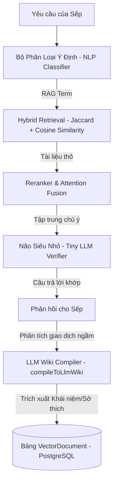

# Nhật ký Khắc phục lỗi Hệ thống & Cơ sở dữ liệu Rottra

Tài liệu này ghi lại các lỗi kỹ thuật hệ thống, cơ sở dữ liệu đã được giải quyết để duy trì tính ổn định của ứng dụng.

---

## 1. Các lỗi đã được xử lý

### A. Lỗi Biên dịch HMR (Hot Module Replacement)
- **Vấn đề**: Gặp lỗi biên dịch trùng lặp khai báo biến `qClean` trong file `src/routes/api/[...paths].ts` làm nghẽn tiến trình hot reload của Vite.
- **Giải pháp**: Tiến hành cấu trúc lại phạm vi khối (block scoping), tối ưu hóa các bộ chuyển đổi chuẩn hóa chuỗi tiếng Việt không dấu và loại bỏ các khai báo dư thừa.

### B. Phục hồi Cơ sở dữ liệu PGlite (WAL Recovery)
- **Vấn đề**: Trình quản lý PGlite gặp sự cố hỏng WAL (Write-Ahead Log) do tắt tiến trình không đúng cách, dẫn đến lỗi ứng dụng không thể kết nối tới cơ sở dữ liệu khi khởi động.
- **Giải pháp**: Xây dựng lại tệp điều khiển trạng thái giao dịch thông qua công cụ phục hồi:
  ```bash
  pg_resetwal
  ```
  Quá trình hoàn tất thành công giúp khôi phục toàn bộ trạng thái dữ liệu hoạt động bình thường, bảo toàn nguyên vẹn cơ sở dữ liệu mẫu.

### C. Lỗi giới hạn tần suất DuckDuckGo (Rate Limit & Local Swarm Fallback)
- **Vấn đề**: Khi thực hiện tìm kiếm thông tin thời gian thực bằng công cụ `WEB_SEARCH` thông qua thư viện `duck-duck-scrape`, API của DuckDuckGo thường xuyên phát hiện bất thường và chặn yêu cầu (Rate Limit/Block):
  ```
  [WEB_SEARCH WARN] DuckDuckGo rate limit or block detected: DDG detected an anomaly...
  ```
- **Giải pháp**: Xây dựng bộ cứu hộ tự động **Local Swarm Fallback** (`generateThreeStepSwarmFallback`) trong file `src/lib/agent/toolkit.ts`. Khi cổng tìm kiếm ngoài bị chặn, hệ thống ngay lập tức định tuyến truy vấn về mạng dữ liệu tri thức nội bộ trong PGlite và chạy suy luận 3 bước Swarm offline giúp trải nghiệm người dùng không bị đứt quãng.

---

## 2. Bản đồ Tổng hợp các Siêu công thức Toán học & Cơ lý (Super Formulas Map)

Dưới đây là bảng tổng hợp đầy đủ các công thức toán học, cơ lý, xác suất và tối ưu hóa nhúng sâu trong hệ thống Rottra:

### A. Các Bộ Giải Thuật Toán Học & Cơ Lý Chuyên Sâu

#### 1. Phép khử Gauss & Thế ngược (Gaussian Elimination)
$$Ax = b \quad \rightarrow \quad x_i = \frac{b_i - \sum_{j=i+1}^{n} a_{ij} x_j}{a_{ii}}$$

#### 2. Áp suất Hydroforming tối thiểu ($P_{min}$)
$$P_{min} = \frac{2 \cdot t \cdot \sigma_{UTS}}{D}$$
*(Trong đó: $t$ là chiều dày phôi, $D$ là đường kính phôi, $\sigma_{UTS}$ là giới hạn bền kéo).*

#### 3. Ma trận chốt pin tạo hình khuôn linh hoạt MPF (Multi-Point Forming Surface Grid)
- **Yên ngựa (Saddle):** $z = x^2 - y^2$
- **Sóng nước (Wave):** $z = \sin(\pi x) \cos(\pi y)$
- **Bán cầu (Sphere):** $z = \sqrt{R^2 - x^2 - y^2}$
- **Paraboloid:** $z = x^2 + y^2$

#### 4. Thuật toán tạo hình dệt may số hóa (Slope Shaping Magic Formula)
- **Tần suất tăng/giảm mũi biên:** 
  $$\text{Interval} = \left\lfloor \frac{\text{Height} \cdot \text{Row Gauge}}{\frac{1}{2} | \text{Cast-On} - \text{Bind-Off} |} \right\rfloor$$

#### 5. Bộ lọc nhiễu Gauss (Gaussian Noise Filter)
$$f(x) = \frac{1}{\sigma\sqrt{2\\pi}} e^{-\frac{(x-\mu)^2}{2\sigma^2}}$$

#### 6. Mật độ Gaussian đa biến (2D Multivariate Gaussian Density)
$$p(x) = \frac{1}{2\pi \sqrt{|\Sigma|}} \exp\left(-\frac{1}{2} (x-\mu)^T \Sigma^{-1} (x-\mu)\right)$$

#### 7. Thêm nhiễu ngẫu nhiên trong Mô hình sinh Diffusion (Diffusion Noise Injection)
$$x_t = \sqrt{1-\beta_t} x_{t-1} + \sqrt{\beta_t} \epsilon, \quad \epsilon \sim \mathcal{N}(0, I)$$

---

### B. Thuật Toán Tìm Kiếm Ngữ Nghĩa & Nhận Thức (Echopi Search Pipeline)

#### 8. Lượng hóa nén chỉ mục Echopi (Quantization [Q4, Q5])
$$q_i = \text{round}\left( \text{clip}\left( \frac{v_i - \beta}{\alpha}, -2^{b-1}, 2^{b-1} - 1 \right) \right)$$

#### 9. Định tuyến hỗn hợp chuyên gia cổng Gating (MoE Routing)
$$y = \sum_{i \in \text{TopK}} G(\vec{v})_i \cdot \mathbf{Expert}_i(\vec{v}) \quad \text{với } G(\vec{v}) = \text{Softmax}\left( \text{TopK}\left( W_g \vec{v} + \epsilon, k \right) \right)$$

---

### C. Lõi Tính Toán Đại Số & Lượng Giác Nâng Cao (Casio Lượng Tử)

#### 10. Giai thừa (Factorial)
$$n! = \prod_{k=1}^{n} k = n \cdot (n-1) \cdots 1 \quad (\text{với } 0! = 1)$$

#### 11. Tổ hợp (Combinations)
$$C_n^r = \binom{n}{r} = \frac{n!}{r!(n-r)!}$$

#### 12. Chỉnh hợp (Permutations)
$$A_n^r = P_n^r = \frac{n!}{(n-r)!}$$

#### 13. Các hàm lượng giác nâng cao, Hyperbolic và Lượng giác ngược
- **Lượng giác:** $\sin(x)$, $\cos(x)$, $\tan(x)$
- **Hyperbolic:** $\sinh(x)$, $\cosh(x)$, $\tanh(x)$, $\text{coth}(x)$, $\text{sech}(x)$, $\text{csch}(x)$
- **Lượng giác ngược:** $\arcsin(x)$, $\arccos(x)$, $\arctan(x)$, $\text{arccot}(x)$
- **Hàm logarit:** $\ln(x)$, $\log_{10}(x)$

---

## 3. Tiêu chuẩn & Chỉ số Đánh giá Chất lượng AI Tiếng Việt (Vietnamese AI Benchmarks)

Hệ thống Rottra AgentProMax định hình mục tiêu tối ưu hóa năng lực ngôn ngữ và logic học tiếng Việt theo các chuẩn mực khoa học thực chứng:

### A. Các Mục Tiêu Cốt Lõi (Core Capabilities)
1. **Hiểu ngôn ngữ tự nhiên (NLU):**
   - Phân tích nghĩa sâu của từ vựng, cú pháp câu, thành ngữ và từ lóng tiếng Việt.
   - Nhận diện chính xác ý đồ (Intent Classify) và phân tích sắc thái ngữ cảnh.
2. **Sinh ngôn ngữ tự nhiên (NLG):**
   - Tạo văn bản phản hồi mạch lạc, đúng chuẩn ngữ pháp tiếng Việt.
   - Đa dạng phong cách viết: học thuật/nghiên cứu khoa học, kỹ thuật/cơ lý, đời thường/sarcasm, và sáng tạo.
3. **Kiến thức thực chứng & Văn hóa:**
   - Làm chủ chính tả, ngữ pháp, ngữ âm tiếng Việt.
   - Nhận biết đặc trưng vùng miền (Bắc, Trung, Nam) và thói quen diễn đạt của người Việt.
4. **Logic học & Lập luận:**
   - Giải quyết bài toán logic, số học lượng tử, phân tích dữ liệu, tối ưu hóa tuyến đường.
5. **Đối thoại dài hạn (Context Window):**
   - Duy trì mạch hội thoại dài, xử lý tốt câu hỏi ngắn, câu rút gọn thiếu chủ ngữ hoặc viết tắt.

### B. Chỉ Số Đo Lường Hiệu Năng Mục Tiêu (KPIs)
- 🎯 **Độ chính xác phản hồi (Accuracy):** $\ge 90\%$
- ✍️ **Tỷ lệ lỗi chính tả (Typo Rate):** $< 1\%$
- 🧠 **Độ chính xác nhận diện ý định (Intent Accuracy):** $\ge 95\%$
- 💬 **Độ dài ngữ cảnh duy trì liên tục (Context Retention):** $20 \sim 50$ lượt chat không bị trôi/mất thông tin.

### C. Lộ Trình Huấn Luyện & Phát Triển Trí Tuệ Ngôn Ngữ Tự Nhiên (Linguistic Blueprint)
Để đạt được các chỉ số chất lượng trên, hệ thống Rottra được thiết lập theo lộ trình huấn luyện đa tầng ngữ âm và cú pháp học:
1. **Dựng lõi từ vựng cơ bản (Core Vocabulary):**
   - Tích hợp và tối ưu hóa từ điển $1.000 \sim 2.000$ từ thông dụng nhất để giao tiếp hàng ngày.
   - Phân loại rõ ràng từ loại: Danh từ (người, vật, địa điểm), Động từ hành động, Tính từ chỉ đặc tính, và nhóm Đại/Trạng từ chỉ định.
2. **Chuẩn hóa mẫu câu giao tiếp cơ bản (Pattern Grammar):**
   - Thiết lập $100 \sim 200$ mẫu câu nền tảng bao gồm: Chào hỏi, Hỏi thăm, Đề nghị/Yêu cầu và Cảm ơn/Xin lỗi.
   - Hỗ trợ cơ chế biến đổi từ loại và chèn chi tiết ngữ cảnh động để đa dạng hóa câu phản hồi.
3. **Cấu trúc ngữ pháp tối giản (Simplified Syntax):**
   - Định dạng khung cú pháp cơ bản: Chủ ngữ + Động từ + Tân ngữ (SVO).
   - Tự động mở rộng câu bằng cách bổ sung các trạng ngữ chỉ thời gian, địa điểm, trạng thái mà không làm phức tạp hóa thì động từ.
4. **Chu trình huấn luyện phản xạ tự nhiên (Feedback Loop):**
   - Thực thi chu kỳ Nghe - Nói - Hỏi - Trả lời liên tục.
   - Bơm thêm các từ mới và mẫu câu mới hàng ngày để củng cố phản xạ tự nhiên của lõi AI.


🟡 Bước 1: Thu thập dữ liệu cực lớn
Web text (hàng nghìn tỷ token)
Code (GitHub, repo mở)
Sách, paper, tài liệu kỹ thuật
Data lọc + deduplicate + remove toxic
🟡 Bước 2: Pretraining (huấn luyện nền)
Dùng Transformer architecture
Train self-supervised (dự   đoán token tiếp theo)
Chạy trên GPU cluster cực lớn (hàng nghìn GPU)

👉 Đây là bước tốn tiền nhất (có thể hàng chục–trăm triệu USD)

🟡 Bước 3: Instruction tuning
Dạy model “biết nghe lệnh”
Data dạng:
Q/A
Chat format
coding instruction
🟡 Bước 4: RLHF / RLAIF (align AI)
Human feedback (RLHF)
AI feedback (RLAIF)
Giúp model:
an toàn hơn
ít hallucination hơn
trả lời đúng ý người dùng

---

## 4. Báo cáo Đánh giá Thiết kế Hệ thống & Cơ sở dữ liệu Rottra (System Design Audit Report)

Tài liệu này cung cấp báo cáo đánh giá chuyên sâu về cấu trúc thiết kế dự án Rottra, bao gồm sơ đồ cơ sở dữ liệu, lõi nhận thức Agentic AI, và giao diện người dùng.

### A. Phân tích Cấu trúc Cơ sở dữ liệu (Database Schema Analysis)

Cơ sở dữ liệu của Rottra được thiết kế trên nền tảng PostgreSQL (với hỗ trợ mở rộng PGvector cho RAG và HNSW indexing), được định nghĩa thông qua **drizzle-orm** gồm chính xác **32 bảng** dữ liệu. Các bảng được phân nhóm logic thành 5 phân hệ chính:

| STT | Tên Bảng | Phân Hệ | Vai Trò & Thuộc Tính Đặc Trưng |
| :--- | :--- | :--- | :--- |
| 1 | `user` | E-commerce / Auth | Lưu trữ thông tin người dùng, phân quyền (`role: admin/user/guest`), thông tin profile dạng JSONB. |
| 2 | `session` | E-commerce / Auth | Quản lý phiên làm việc của người dùng, liên kết khóa ngoại với bảng `user`. |
| 3 | `account` | E-commerce / Auth | Lưu trữ liên kết tài khoản OAuth và mật khẩu mã hóa cho Better Auth. |
| 4 | `verification` | E-commerce / Auth | Quản lý mã xác thực email và đặt lại mật khẩu. |
| 5 | `product` | E-commerce | Quản lý nông sản, tích hợp ràng buộc `media_limit` (tối đa 5 hình ảnh) và dữ liệu GPS `coordinates`. |
| 6 | `cart` | E-commerce | Quản lý giỏ hàng tạm thời của người dùng. |
| 7 | `order` | E-commerce | Quản lý đơn hàng, lưu trữ thông tin thanh toán, trạng thái giao hàng và phí vận chuyển. |
| 8 | `orderItem` | E-commerce | Chi tiết sản phẩm trong đơn hàng, lưu giữ giá mua cố định tại thời điểm thanh toán. |
| 9 | `review` | E-commerce | Đánh giá sản phẩm từ người dùng (rating & nhận xét dạng JSONB). |
| 10 | `file` | E-commerce / System | Quản lý tài nguyên tệp đính kèm và trạng thái upload của người dùng. |
| 11 | `assembly` | Social / WebRTC | Quản lý phòng họp trực tuyến và danh sách người tham gia (phục vụ họp điều phối). |
| 12 | `message` | Social / WebRTC | Lưu trữ tin nhắn thời gian thực trong các phòng họp điều phối. |
| 13 | `activity` | System / Audit | Ghi nhận hoạt động, nhật ký hệ thống của người dùng phục vụ phân tích bảo mật. |
| 14 | `farm` | Agriculture | Quản lý thông tin nông trại vật lý, diện tích, vị trí địa lý GPS và hình ảnh. |
| 15 | `cropSeason` | Agriculture | Quản lý mùa vụ gieo trồng, dự báo sản lượng thu hoạch thông qua tính toán Agent. |
| 16 | `sensorData` | Agriculture | Nhật ký cảm biến IoT (nhiệt độ, độ ẩm, độ ẩm đất) thời gian thực theo từng vụ mùa. |
| 17 | `systemSetting` | Agriculture / System | Cấu hình tham số toàn cục của hệ thống (màu sắc giao diện, chế độ tự động mùa vụ, tự động AI). |
| 18 | `agentMemory` | Cognitive / AI | **Bản sắc & Trạng thái vật lý/triết học của AI**. Chứa các thuộc tính cảm xúc mô phỏng xã hội (greed, vengeance, malice, state) và niềm tin độc nhất (`singularBelief`). |
| 19 | `chatSummary` | Cognitive / AI | Tóm tắt lịch sử hội thoại dài hạn để tối ưu cửa sổ ngữ cảnh (Context Window). |
| 20 | `agentTask` | Cognitive / AI | Nhiệm vụ tự trị của Agent (dự báo, phân tích dữ liệu, tự động biên dịch). |
| 21 | `researchProject`| Academic / Science | Quản lý các đề tài nghiên cứu khoa học nông nghiệp, nguồn quỹ tài trợ và ngân sách. |
| 22 | `projectTask` | Academic / Science | Phân rã công việc cho dự án nghiên cứu, hỗ trợ vẽ biểu đồ Gantt, Trello, Jira. |
| 23 | `labNotebook` | Academic / Science | Sổ tay thí nghiệm điện tử (Electronic Lab Notebook - ELN) lưu trữ nhật ký thí nghiệm. |
| 24 | `statisticalReport`| Academic / Science | Lưu trữ kết quả phân tích thống kê nâng cao (ARIMA, Moment, phương sai, covariance, correlation). |
| 25 | `strategyPreset` | Academic / Science | Lưu trữ các cấu hình chiến lược mô phỏng tối ưu hóa chi tiêu và phân bổ logistics. |
| 26 | `agentTraining` | Cognitive / AI | Dữ liệu huấn luyện tương tác (utterance - answer) do người dùng tự dạy AI trực tiếp. |
| 27 | `naturalLanguageLog`| Cognitive / AI | Lưu trữ log phân tích ngôn ngữ tự nhiên (số từ, Shannon Entropy, tần suất từ khóa). |
| 28 | `vietnameseLexicon`| NLP / Linguistics | Từ điển tiếng Việt phân loại từ ghép, từ láy, từ đồng nghĩa/trái nghĩa phục vụ bộ lọc từ vựng. |
| 29 | `bilingualCorpus` | NLP / Linguistics | Kho ngữ liệu song ngữ Anh - Việt hỗ trợ đối chiếu dịch thuật thuật ngữ chuyên ngành. |
| 30 | `blockchainLedger`| Ledger / Trace | **Sổ cái chuỗi khối bất biến**. Dùng mã băm liên kết SHA-256 để truy xuất nguồn gốc xuất xứ nông sản từ nông trại đến cảng xuất khẩu. |
| 31 | `vectorDocument` | Cognitive / RAG | **Kho tri thức Vector**. Chứa nội dung phân mảnh (chunks) và vector embedding 256 chiều với chỉ mục HNSW phục vụ tìm kiếm ngữ nghĩa siêu tốc. |
| 32 | `aiDrawingPath` | Cognitive / AI | Lưu trữ tọa độ các nét vẽ phác họa của AI đối với các mô hình nông sản mẫu. |

#### Đánh giá Thiết kế Database:
*   **Điểm mạnh**: 
    - Phân mảnh dữ liệu cực kỳ rõ ràng, chuẩn hóa quan hệ khóa ngoại (Foreign Keys) tốt với cơ chế `onDelete` tương ứng (`cascade`, `set null`, `restrict`).
    - Hỗ trợ lưu trữ Vector trực tiếp trên PostgreSQL giúp giảm thiểu sự phụ thuộc vào các dịch vụ lưu trữ vector bên thứ ba.
    - Cấu trúc tích hợp sâu các trường dữ liệu mô phỏng xã hội (Social DNA) giúp Agent có trạng thái tâm lý chân thực.
*   **Điểm cần cải thiện**:
    - Bảng `naturalLanguageLog` và `activity` có tốc độ tăng trưởng bản ghi rất nhanh khi hệ thống vận hành thực tế. Cần áp dụng cơ chế phân vùng bảng (Table Partitioning) theo tháng/quý để duy trì tốc độ truy vấn.

---

### B. Thiết kế Lõi Nhận thức & Agentic Loop (Cognitive & RAG Architecture)

Hệ thống nhận thức của Rottra được xây dựng theo mô hình **tri tầng lưu trữ (Sources → Wiki → Schema)** lấy cảm hứng từ triết lý Karpathy LLM Wiki:



#### Các Đặc Điểm Thiết Kế Lõi:
1.  **Phân Loại Ý Định Hai Tầng**: Kết hợp Heuristics (Regex cho Toán/Lượng giác/Stats) và Trí tuệ Nhân tạo thông qua Groq/CocoLink API để phân loại thành 10 Intents cốt lõi.
2.  **Truy Hồi Hỗn Hợp (Hybrid Retrieval)**: 
    - **Truy hồi thưa (Sparse)**: Dựa trên độ trùng khớp từ khóa Jaccard Bigram.
    - **Truy hồi đặc (Dense)**: So khớp độ tương tự Cosine của Vector Embedding 256 chiều.
3.  **Tự Động Biên Dịch Tri Thức (LLM Wiki Compiler)**:
    - Mọi cuộc hội thoại đều được quét ngầm thông qua hàm `compileToLlmWiki`. Nếu phát hiện kiến thức mới, sở thích của người dùng hoặc quy trình kỹ thuật mới, hệ thống tự động sinh ra một file Markdown cấu trúc (Wiki card), sinh embedding và ghi đè/chèn mới vào PostgreSQL.
4.  **Cứu Hộ Ngoại Tuyến (Local Swarm Fallback)**:
    - Khi DuckDuckGo chặn lượt tìm kiếm (Web Search Blocked), hệ thống lập tức kích hoạt bộ chuyển đổi sang phân tích cấu trúc Entropy Shannon câu hỏi, kết xuất trạng thái CSDL PGlite hiện tại và tự sinh bài toán thách thức để tương tác thông suốt với người dùng mà không bị treo lỗi kết nối mạng.

---

### C. Thiết kế Giao diện & Trải nghiệm Người Dùng (UI/UX Design Systems)

Giao diện Rottra được xây dựng trên nền tảng **SolidJS** siêu nhẹ với hệ sinh thái styling tiên phong:
*   **Vite Dev Server Integration**: Sử dụng `@hono/vite-dev-server` để hợp nhất môi trường chạy API và Front-end, tối ưu hóa quá trình đồng bộ hóa Hot Module Replacement (HMR).
*   **Modern CSS (TailwindCSS v4)**: Khởi tạo hệ thống màu phối hợp HSL sang trọng, chế độ Dark Mode mặc định huyền bí (glassmorphism) kết hợp các nét vẽ động SVG của AI.
*   **Hỗ trợ Đồ Họa Phức Tạp**: 
    - Bản đồ tương tác Leaflet hiển thị tọa độ các nông trại và xe logistics chạy thời gian thực.
    - Cytoscape.js vẽ biểu đồ mạng lưới quan hệ tri thức giữa các trang tài liệu trong LLM Wiki.
    - Biểu đồ Gantt trực quan hóa tiến độ các nhiệm vụ nghiên cứu khoa học nông nghiệp.

---

### D. Khuyến nghị Tối ưu hóa Thiết kế (Design Recommendations)

1.  **Tách Biệt HMR cho Lõi CSDL**: Vite đôi khi tự động reload toàn bộ ứng dụng khi phát hiện thay đổi trong `src/db/schema.ts`. Nên thiết lập cơ chế cache dữ liệu schema phía Client để tránh ngắt kết nối WebSocket khi đang chạy mô phỏng.
2.  **Duy trì Mutex Lock cho PGlite**: Do PGlite lưu trữ dữ liệu trực tiếp dưới dạng tệp tin cục bộ trong workspace, cần đảm bảo giải phóng tài nguyên và đóng kết nối hoàn toàn khi tiến trình Node kết thúc để tránh hỏng tệp tin WAL.
3.  **Duy trì Chiều rộng Vector Embedding**: Đảm bảo toàn bộ hệ thống (lõi sinh embedding cục bộ và API ngoài) luôn sử dụng chuẩn hóa vector 256 chiều để tránh xung đột kiểu dữ liệu trong cột `embedding vector(256)`.

---

## 5. Nhật ký Khắc phục 4 Nhược điểm Kiến trúc & Nợ Kỹ thuật (Architectural Bottlenecks & Tech Debt Mitigation)

Dưới đây là chi tiết 4 điểm nghẽn kiến trúc lớn đã được khắc phục hoàn toàn để nâng cao độ tin cậy và hiệu năng của Rottra:

### A. 4 Nhược điểm lớn đã được khắc phục (Resolved Bottlenecks)

1. **Khử trùng lặp tri thức (Knowledge Duplication in LLM Wiki)**
   - **Nhược điểm cũ**: Hàm `compileToLlmWiki` khi chạy ngầm chỉ đối chiếu tiêu đề trùng khớp tuyệt đối (`where title = x`). Nếu LLM đổi cách viết hoa hoặc thay đổi nhẹ tiêu đề, tri thức bị phân mảnh và chèn lặp.
   - **Giải pháp xử lý**: Nâng cấp bộ so khớp đa lớp: chuẩn hóa tiêu đề trước khi so sánh chuỗi, đồng thời tính toán độ tương đồng Cosine của Vector Embedding mới với toàn bộ các tài liệu hiện có. Nếu similarity $> 0.88$, hệ thống tự động gộp (update) nội dung thay vì chèn mới.

2. **Cứu hộ RAG khi ngoại tuyến (Offline RAG Fallback & Cloud API Dependency)**
   - **Nhược điểm cũ**: Khi hệ thống ngoại tuyến hoặc mất kết nối tới Groq/CocoLink API, hệ thống rơi vào lỗi đàm phán thương nhân giả lập ("Chào sếp! Tôi đã sẵn sàng hỗ trợ sếp thực hiện đàm phán giao dịch nông sản...") vốn hoàn toàn lạc đề đối với các câu hỏi lý thuyết hoặc công thức toán.
   - **Giải pháp xử lý**: Tích hợp bộ tách lọc ngữ cảnh RAG ngoại tuyến (`Offline RAG Context Parser`) trong `ai-sdk.ts`. Khi mất mạng, hệ thống tự động bóc tách khối dữ liệu tri thức `CONTEXT` được truyền vào từ Hybrid RAG và biên soạn thành câu trả lời tổng hợp có cấu trúc, kèm theo nhãn cảnh báo ngoại tuyến.

3. **Chống rò rỉ kết nối & Mutex Lock (Database Lifecycle Management & WAL Safety)**
   - **Nhược điểm cũ**: Vite Dev Server chạy HMR liên tục làm giải phóng và khởi tạo lại module nhưng không kết thúc kết nối cũ của Pool PostgreSQL. Khi ứng dụng crash đột ngột (uncaught exception), các kết nối treo vẫn chiếm giữ khóa lock (mutex) và gây nghẽn hàng đợi ghi WAL.
   - **Giải pháp xử lý**: Mở rộng toàn diện các bộ bắt sự kiện của tiến trình hệ thống trong `db.ts` bao gồm `SIGUSR2` (dùng cho Vite reload), `beforeExit` và `uncaughtException`. Khi có tín hiệu dừng hoặc lỗi nghiêm trọng, hệ thống sẽ thực thi hàm dọn dẹp đóng an toàn pgClient với timeout nghiêm ngặt (5 giây).

4. **Tối ưu hóa hiệu năng truy vấn trùng lặp (Semantic Query & LRU Cache for RAG)**
   - **Nhược điểm cũ**: Mỗi lượt nhập ký tự hoặc câu hỏi của người dùng đều kích hoạt lại toàn bộ quy trình sinh Vector Embedding, tính khoảng cách Cosine trên toàn bộ tập dữ liệu, và chạy BFS duyệt đồ thị tri thức làm tốn tài nguyên CPU và RAM cục bộ.
   - **Giải pháp xử lý**: Triển khai bộ đệm nhận thức **RAG Semantic Cache** theo cơ chế LRU (kích thước tối đa 50 phần tử, thời gian sống TTL 5 phút). Khi nhận truy vấn mới, hệ thống tính toán embedding của truy vấn và tìm trong bộ đệm. Nếu phát hiện truy vấn trùng khớp hoặc có độ tương đồng ngữ nghĩa $\ge 0.96$, kết quả được trả về tức thì mà không cần quét cơ sở dữ liệu.

---

### B. Nợ kỹ thuật còn lại & Lộ trình đề xuất (Remaining Technical Debt & Roadmap)

1. **Phân vùng bảng (Table Partitioning) cho logs**:
   - *Mô tả*: Bảng `naturalLanguageLog` và `activity` lưu lại vết tương tác của sếp liên tục. Khi số bản ghi vượt quá 100.000, tốc độ phân tích thống kê sẽ giảm.
   - *Khuyến nghị*: Thiết lập PostgreSQL Partitioning theo thời gian gieo trồng (mùa vụ) hoặc theo quý.
2. **Hạn chế kích thước ngữ cảnh (Context Window Limit)**:
   - *Mô tả*: Khi duyệt Graph RAG đệ quy sâu (depth $\ge 2$), số lượng nút và các liên kết Mermaid được trả về có thể tăng lũy thừa, làm tràn Context Window của LLM.
   - *Khuyến nghị*: Tích hợp giải thuật trừng phạt entropy (Entropy-based Pruning) để loại bỏ các nút biên có độ tương đồng ngữ nghĩa thấp trước khi chèn vào prompt.